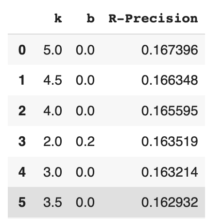
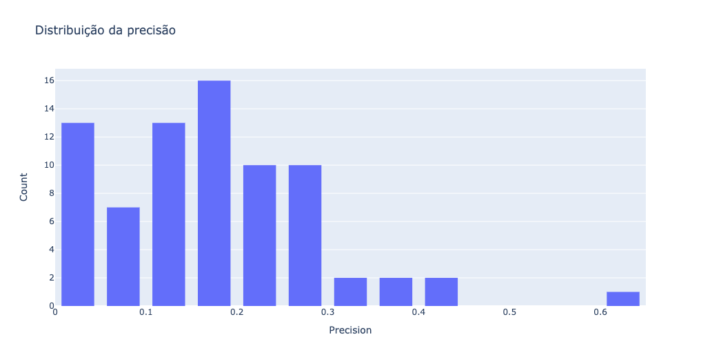

# Avaliando BM25 no CISI

**Autor:** Pedro Gabriel Gengo Lourenço

## 1. Descrição

Esse repositório contém todo o código desenvolvido para o processo de seleção da disciplina "Deep Learning aplicado a sistemas de buscas" ofertada no primeiro semestre de 2023 pela FEEC-Unicamp. O exercício proposto solicitou a construção de um sistema de recuperação de informação usando o algoritmo BM25 e avaliando os resultados no dataset CISI. Além disso, foi estimulado o uso do ChatGPT para auxiliar durante toda a construção da solução.

Na seção [2](#2) do presente relatório é descrito como o ChatGPT foi utilizado para a resolução do desafio proposto. Na seção [3](#3) é apresentada a estrutura do repositório, assim como uma descrição de cada um dos arquivos. Na seção [4](#4) é explicado como reproduzir o experimento e as seções [5](#5), [6](#6) e [7](#7) apresentam os resultados em relação ao dataset CISI, assim como as conclusões e possíveis melhorias.

## <a name="2"></a>2. Como o ChatGPT foi utilizado?

O ChatGPT foi usamos para prover alguns guias sobre como começar o código para processar o dataset CISI e como criar o index reverso a ser usado pelo BM25 e também o próprio algoritmo do BM25. Para ter certeza que o ChatGPT entenderia que estava falando com ele sobre CISI e BM25 no contexto de recuperação da informação, a primeira coisa feita foi iniciar questionando sobre o que era recuperação da informação e o algoritmo BM25, o que criou o contexto necessário para o ChatGPT.

Após isso, pedi ao ChatGPT que escrevesse um código em Python para baixar e ler os arquivos do dataset CISI (cisi.all, cisi.qry and cisi.rel). O código retornado era todo baseado em regex, porém as expressões utilizadas estavam mais abrangentes que o necessário. Um exemplo foi uma das expressões que pegava todo o texto que aparecia após um `W\s`. Contudo, nos textos existiam alguns nomes de pessoas que terminavam com `W` e depois pulava uma linha ou havia um espaço, fazendo com que essa expressão considerasse casos que não deveriam ser considerados. Por esse motivo foram necessárias algumas pequenas adaptações e a criação de alguns testes de sanidade para ter certeza que tudo estava sendo processado da maneira correta.

Para a implementação do algoritmo do BM25 não houveram muitos problemas ou mudanças, apenas pedi ao ChatGPT por um código e fiz algumas pequenas limpezas e otimizações no código.

## <a name="3"></a>3. Estrutura do repositório
```
.
└── CISI_BM25/
    ├── notebooks/
    |   ├── CISI_Results.ipynb: Integra os outros dois notebooks e avalia os resultados no CISI
    │   ├── Developing_BM25.ipynb: Explicação do BM25 e sua implementação
    │   └── Downloading_and_Processing_CISI.ipynb: Detalhes sobre como baixar e processar o CISI
    ├── README.md
    ├── results.png
    ├── precision_dist.png
    └── LICENSE
```

## <a name="4"></a>4. Como reproduzir o experimento?

Com o intuito de facilitar a reprodução da solução foi decidido manter os resultados em apenas um notebook (caso queira explicações detalhadas é possível consultar os outros notebooks da pasta `notebooks`).

Para reproduzir o experimento abra o notebook [CISI_Results.ipynb](https://colab.research.google.com/drive/1fHQnq-6zXl1qtZoKZnH17HZVnojZfmp9?usp=sharing) e execute todas as células. Ao final você verá os resultados!

## <a name="5"></a>5. Resultados

Revisando alguns outros trabalhos de recuperação da informação a métrica escolhida foi o R-Precision (Precision at 10), a qual, sabendo previamente o número de documento relevantes para cada query, avalia a P@N, onde N é o número de documentos relevantes por query. Sendo assim, para cada query, o denominador irá mudar e será mais justo. Se usássemos P@10, a qual é uma métrica muito comum, poderíamos acabar penalizando casos onde temos menos que 10 documentos relevantes. Para obter os melhores resultados foi realizada uma busca exaustiva nos hiperparâmetros $k_1$ e $b$ e o resultado pode ser visto abaixo:

<p align="center">
    
</p>

Analisando a distribuição de precisões por documentos usando os melhores hiperparâmetros, obtemos:

<p align="center">
    
</p>

## <a name="6"></a>6. Conclusões

Podemos concluir que o BM25 pode ser usado com um excelente baseline para comparar outros algoritmos/modelos, uma vez que apresenta um ótimo custo-benefício entre resultado e simplicidade. Além disso, é muito importante ressaltar que, dada a quantidade de documentos, muitas vezes nem todos os documentos que são de fato relevantes estão na lista de documentos relevantes. Existem vários motivos para isso acontecer indo desde uma avaliação subjetiva até o simples fato de que ninguém avaliou o par query/documento em questão.

Um exemplo disso é a segunda query (`How can actually pertinent data, as opposed to references or entire articles themselves, be retrieved automatically in response to information requests?`), que tem como documentos relevantes a seguinte lista: `[29,68,197,213,214,309,319,324,429,499,636,669,670,674,690,692,695,700,704,709,720,731,733,738,740,1136]`. Contudo, ao avaliar o documento `790`, vemos que seu conteúdo é aderante a query e deveria ser considerado um documento relevante:

> An automatic indexing method is described in which index tags for documents  are generated by the computer.. The computer scans the text of periodical  articles and automatically assigns to them index terms with their respective  weights on the basis of explicitly defined text characteristics.. A machine  file of document references with their associated index terms is automatically  produced which can be searched on a co-ordinate basis for the retrieval of  specified drug-related information..

## <a name="7"></a>7. Melhorias

Como melhorias que poderiam ser feitas com o intuito de melhorar os resultados, temos:

- Melhorar o tokenizador, removendo stopwords, usando bigramas, pegando apenas os radicais das palavras, ou seja, realizar operações a fim de criar mais conexões entre palavras que são muito próximas;

- Executar a busca dos hiperparâmetros em parelelo, para ganhar tempo;

- Refinar a lista de documentos relevantes, realizando mais anotações e com mais pessoas anotando.